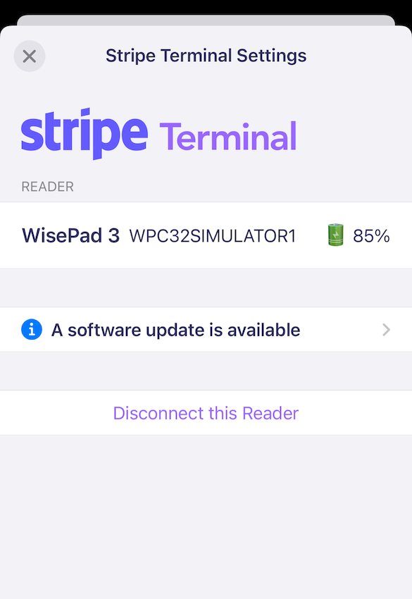

# Astral

An integration of Stripe Terminal for iOS. (Unofficial).

## Description

⚠️ **This library is neither endorsed nor supported by Stripe.** ⚠️

ℹ️ *This library is still in early stage of development and has only been tested on a WisePad3. Your feedback, through github issues, is very welcome.*

Astral relies on [Stripe Terminal iOS SDK](https://github.com/stripe/stripe-terminal-ios) to provide an out-of-the-box solution for handling payments:

- Graphical User Interface
- Connection and reconnections to Readers
- Handling of the payment process 
- Management of errors

It is currently used in our Point-of-Sale app, [incwo POS](https://go.incwo.com/fonctionnalite-caisse-connectee/).

### Features

#### GUI

- Based on UIKit, so it can run on a version as low as iOS 11
- Adapted to iPhone and iPad
- Localized in: en, fr
- Supports ☀️ Light and 🌙 Dark modes

#### Readers

- Handling of updates, either automatic or manual

### Limitations

- Only Bluetooth readers are supported
- Refunds are not supported

## Integration

### Installation in an iOS app

Only Swift Package Manager is supported. 

In Xcode, go to `File > Add Packages` and paste https://github.com/incwo/Astral.

### Configuration of your project

Since Astral relies on the Stripe Terminal SDK, your app needs be configured as [described here](https://stripe.com/docs/terminal/payments/setup-sdk?terminal-sdk-platform=ios#configure). In particular, don't forget to set the keys in the app's `Info.plist`.

### Support on the backend

Your backend needs to call Stripe's API to:

- provide a Connection Token
- capture the funds for a Payment Intent.

Stripe has an extensive documentation:
https://stripe.com/docs/terminal/quickstart

## Usage

### Basic usage

Make a class (or struct) which conforms to the `AstralApiClient` protocol. The methods of this object will be called when your app must send requests to your backend. See `ExampleApiClient` for an example.

Create an instance of `Astral`:

    lazy var astral = Astral(apiClient: YourApiClient())

Then you can show settings:

    astral.presentSettings(from: viewController)

Or charge an amount:

    astral.charge(amount: 9.90, currency: "EUR", presentFrom: viewController) { result in
        switch result {
            case .success (let paymentInfo):
                …
            case .cancelation:
                …
            case .failure (let error):
                …
        }
    }

### Example project

Open `Example/AstralExample.xcodeproj` for an example of integration. See below how to make it run.

The URL of the backend is set in `ExampleApiClient.swift`.

## How to test?

### Running a backend

One of the difficulties is that you will need a backend to test the example or your own integration. Stripe provides a very [simple example backend](https://github.com/stripe/example-terminal-backend https://github.com/stripe/example-terminal-backend). 

The backend needs your Stripe account's secret API key. You can obtain it on [Stripe's API key page](https://dashboard.stripe.com/test/apikeys). There are two keys — this is the one starting with `sk_test` (you should begin in "Test mode").

In our example, we chose to deploy the sample backed locally on our Mac using the Docker container. This should allow testing it quickly on the iOS simulator. However, if you want to test on a physical iOS device and a physical Reader, you'd either have to deploy on Heroku, or activate web sharing on your Mac.

### Testing the (Physical) Reader

Stripe should have sent you a number of Test Cards along with your Reader. Your backend must operate in *test mode* (see above) to try them.

Please note that the **amount which is charged matters**. The last two digits [have a special meaning](https://stripe.com/docs/terminal/references/testing). For instance, paying an amount of 1.55, will cause an *incorrect PIN* error.

## License

MIT License

Copyright (c) 2022 incwo

Permission is hereby granted, free of charge, to any person obtaining a copy
of this software and associated documentation files (the "Software"), to deal
in the Software without restriction, including without limitation the rights
to use, copy, modify, merge, publish, distribute, sublicense, and/or sell
copies of the Software, and to permit persons to whom the Software is
furnished to do so, subject to the following conditions:

The above copyright notice and this permission notice shall be included in all
copies or substantial portions of the Software.

THE SOFTWARE IS PROVIDED "AS IS", WITHOUT WARRANTY OF ANY KIND, EXPRESS OR
IMPLIED, INCLUDING BUT NOT LIMITED TO THE WARRANTIES OF MERCHANTABILITY,
FITNESS FOR A PARTICULAR PURPOSE AND NONINFRINGEMENT. IN NO EVENT SHALL THE
AUTHORS OR COPYRIGHT HOLDERS BE LIABLE FOR ANY CLAIM, DAMAGES OR OTHER
LIABILITY, WHETHER IN AN ACTION OF CONTRACT, TORT OR OTHERWISE, ARISING FROM,
OUT OF OR IN CONNECTION WITH THE SOFTWARE OR THE USE OR OTHER DEALINGS IN THE
SOFTWARE.
