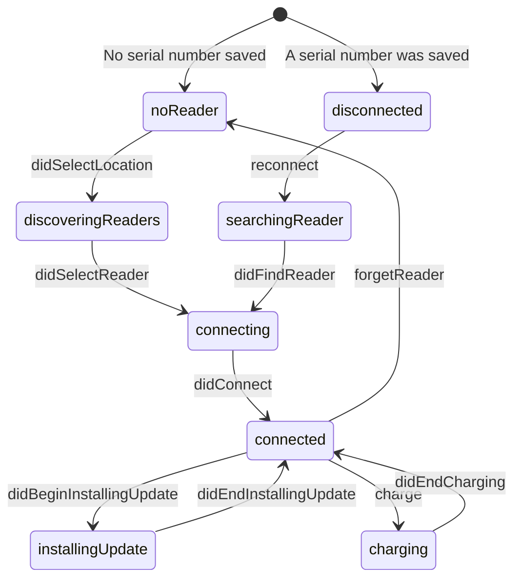

# Development documentation

### TerminalStateMachine

```mermaid
    stateDiagram-v2 
        [*] --> noReader: No serial number saved
        noReader --> discoveringReaders: didSelectLocation
        discoveringReaders --> connecting: didSelectReader

        [*] --> disconnected: A serial number was saved
        disconnected --> searchingReader: reconnect
        searchingReader --> connecting: didFindReader

        %%connecting --> installingUpdate: didBeginInstallingUpdate
        connecting --> connected: didConnect
        connected --> installingUpdate: didBeginInstallingUpdate
        connected --> charging: charge
        connected --> noReader: forgetReader
        

        charging --> connected: didEndCharging 
        installingUpdate --> connected: didEndInstallingUpdate
```

*In order to make the figure clearer, the .didDisconnectUnexpectedly, .cancel and .error events are not represented.*
