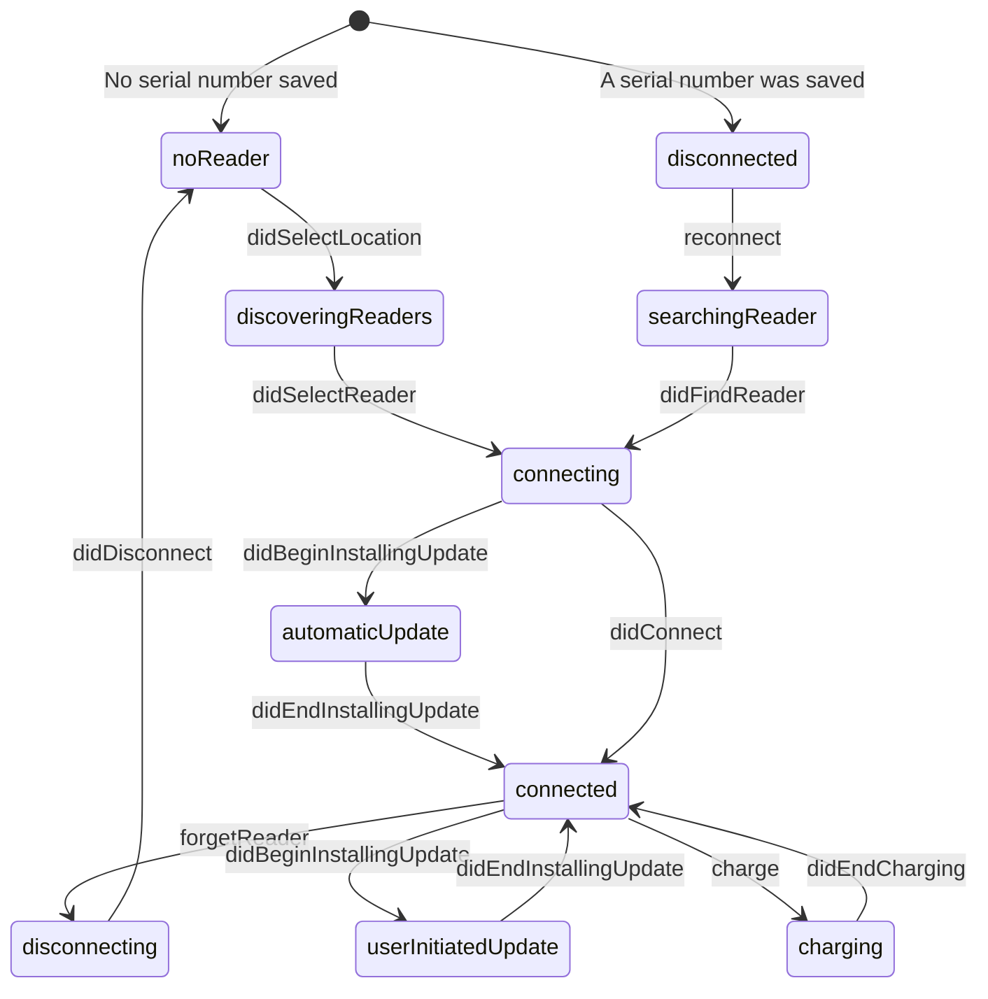

# Development documentation

## Architecture

    Astral
        TerminalModel
            TerminalStateMachine
            ReadersDiscovery
            ReaderConnection
            PaymentProcessor
        ChargeCoordinator
            ChargeViewController
        SettingsCoordinator
            SettingsViewModel -> SettingsTableViewController
            DiscoveryViewModel -> DiscoveryTableViewController
            UpdateViewModel -> UpdateTableViewController 
         

### TerminalStateMachine

`TerminalModel` uses a state machine to keep its internal state, which ensures consistency and that all cases are handled.

*In order to make the figure clearer, the .didDisconnectUnexpectedly, and .canceled events are not represented.*
